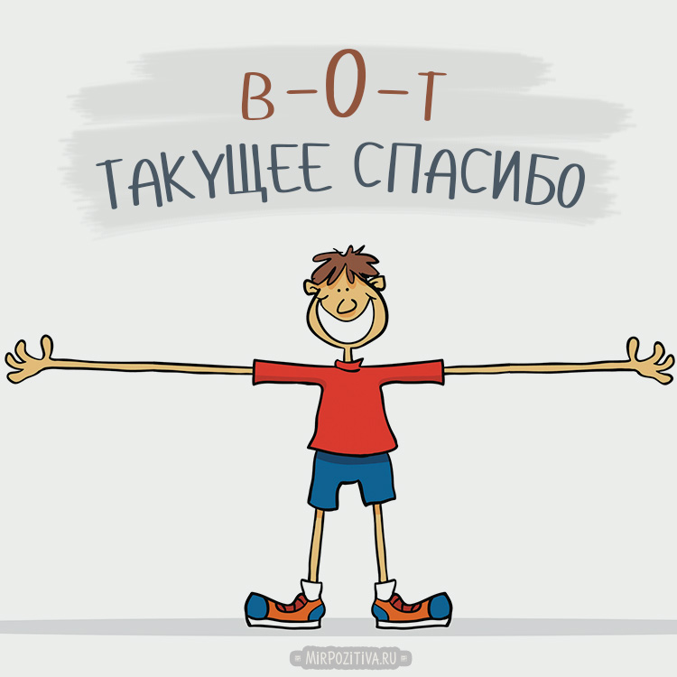

# Основные команды 1 семинара

> git init - инициализация локального репозитория

> git status - получить информацию от Git о его текущем состоянии

> git add - добавить файл в отслеживание (к следующему коммиту)

> git commit -m “message” – создание коммита

> git log – вывод на экран истории всех коммитов с их хеш-кодами

> git checkout – переход от одного коммита к другому

> git checkout master – вернуться к актуальному состоянию и продолжить работу

> Чтобы вставить ссылку - просто вставьте ссылку!

https://www.interesnie-fakty.ru/nauka/kompyurery/o-programmistah-i-programmirovanii/

> Две ** - **Текст будет полужирным, если его записать в двойных 'звёздочках'**

> Одна * - *Текст будет курсивным, если его записать в одинарных 'звёздочках'*

 > А две ~ - ~~Зачеркнёт ваш текст~~ 

Спасибо преподавателю!

# Основные команды 2 семинара